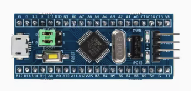
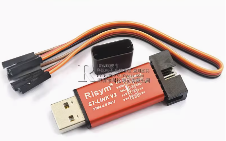
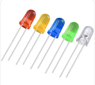
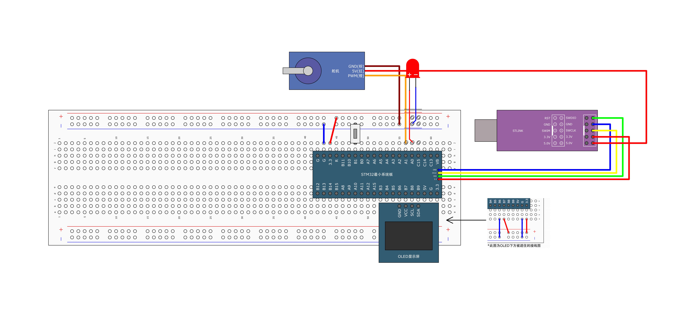

## 功能说明

使用一个定时器的两个输出通道, 设定不同的占空比.

1. 通过按键同时调整舵机的旋转角度和LED的亮度.
2. 每按一次,转 30 度.到180度后,返回 0 度.
3. 在OLED 上显示舵机的角度。

## 硬件模块

* STM32F103C8T6最小系统板

* STLink2 USB调试器

]

* 0.96 OLED液晶屏

* SG90 舵机

* LED

## 接线图

