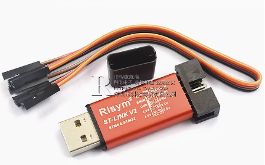
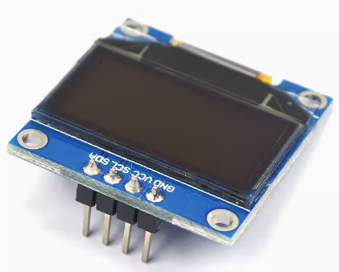

## 功能说明

1. 通过按键调整电机的旋转速度,占空比显示在OLED上.
2. 通过电机编码器与STM32通信, 得到电机的旋转速度, 并通过OLED显示.

## 设计说明

使用TIM2 定时器, 设为输出比较模式 TIM_OCMode_PWM1,
PIN_A2 作为对电机的PWM输出, 通过 PIN_A2 输出 PWM 信号给 TB6612 的PWMA 引脚, 控制电机旋转速度.
PIN_A4 和 PIN_A5 输出电平 给 TB6612 的 AIN2 和 AIN1 引脚,控制电机的方向.
PIN_A6 和 PIN_A7 连接电机的编码器
然后, TB6612 通过对应的 AO1 和 AO2 引脚, 控制电机的转速和转向.

## 硬件设计

STM32F103C8T6最小系统板, 连接TB6612电机驱动, 连接GB37-520电机.

TB6612电机驱动的PWM输出引脚为PA2, 电机的编码器引脚为PA6和PA7.
PIN_A6 和 PIN_A7 连接电机的编码器, 用于与STM32通信,输入编码器的信号给TIM3的CH1 和 CH2 通道, 读取编码器的信号, 得到电机的旋转速度.
PIN_A4 和 PIN_A5 输出电平 给 TB6612 的 AIN2 和 AIN1 引脚,控制电机的方向.

TB6612 的 STBY 引脚给高电平, 正常工作状态; 如果给低电平, 则进入低功耗状态.

## 接线图

## 硬件连接

| STM32F103C8T6最小系统板    | TB6612电机驱动 |  GB37-520电机 |GB37-520电机 |
| :----------------------: | :------------:|:------------:|:------------:|
|     PA2 (TIM2_CH3)       |     PWMA       |              |             |
|     PA4                  |     AIN1       |              |             |
|     PA5                  |     AIN2       |              |             |
|     PA6(TIM3_CH1)        |                |      A相     |             |
|     PA7(TIM3_CH2)        |                |      B相     |             |
|     VCC(即:高电平即可)     |     STBY      |               |             |
|                          |     AO1        |    电机正极   |             |
|                          |     AO2        |    电机负极   |             |
|                          |VM(外部电源的正极) |             |    电源正极  |
|     V3.3 或 V5.0         |VCC(逻辑电源的正极)|    码盘正极  |              |
|                          |     GND        |             |     电源负极  |
|     GND(即:低电平即可)     |GND(逻辑电源的负极)|    码盘负极  |             |

## 运行效果

按下按键, 电机旋转, 占空比显示在OLED上.

## 硬件模块

* STM32F103C8T6最小系统板

* STLink2 USB调试器

]

* 0.96 OLED液晶屏

* GB37-520 电机

* TB6612 电机驱动

