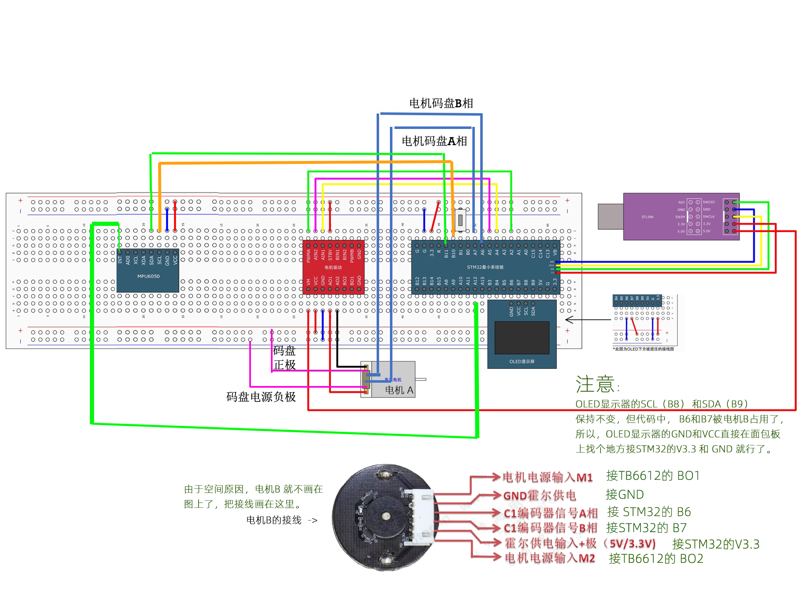

## 乔帮主的乞丐版两轮平衡小车

## 硬件与接线

目录下有一个 excel 文件，是材料清单。
有一个图片，是接线图。

注意：12v电源的正极要接到 TB6612 的 VM 引脚上，这在图中没有画。

## 软件开发环境

vscode + platformIO

1. 如果你安装了上面的软件，直接可以。
2. 如果你使用 Keil5, 就需要自己搬运一下文件的位置了。

## 接线图

